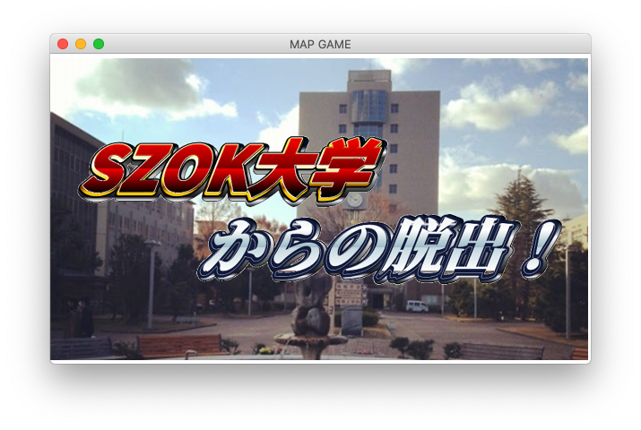
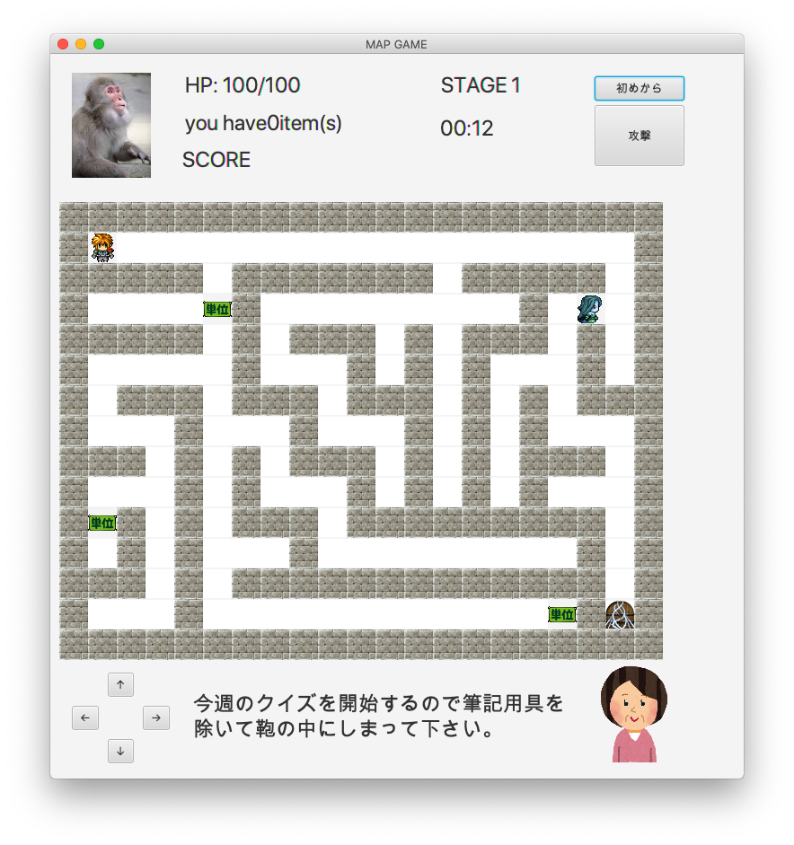

# Escape_from_SZOK

## What is it?

This is a maze game.This was created during a group work session at the university.
You must earn credit as a student.If you finish with a minimum of three credits, you can move on to the next grade.The professor will attack you, so give him or her an assignment to join you.Four grades up, you will graduate and the game is finish.

### Screenshots





## Getting Started

### Prerequisites

This project requires Java 8(includes JavaFX).

```
$ java -version
java version "1.8.0_202"
Java(TM) SE Runtime Environment (build 1.8.0_202-b08)
Java HotSpot(TM) 64-Bit Server VM (build 25.202-b08, mixed mode)
```

### Installing 

Please compile all java files.

```
$ javac *.java
```

### Usage

Entry point is MapGame class.

```
$ java MapGame
```

